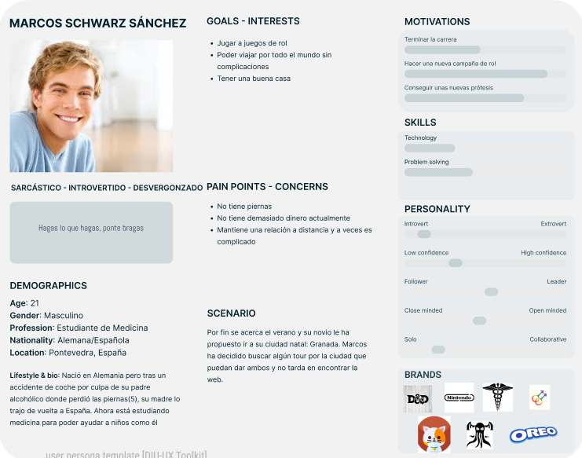
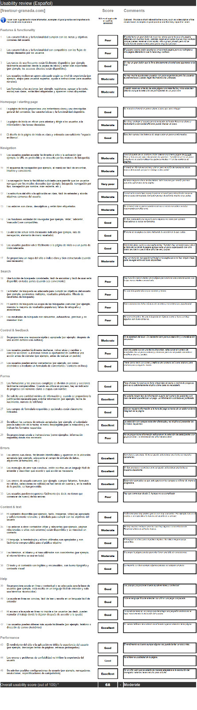

## DIU - Practica1, entregables

 1.a Competitive Analysis
-----

>>>La realización de un análisis competitivo en el que se compara nuestra empresa de tours con otras tres empresas de actividades es fundamental para comprender el panorama del mercado y posicionar mejor nuestra oferta de servicios. Al comparar nuestra página web con la de competidores de diferente calidad, obtenemos una perspectiva más amplia de las áreas en las que sobresalimos y aquellas en las que podemos mejorar. Por ejemplo en ninguna otra pagina encontramos la limitacion de poder registrar solo a 2 niños.

 

 1.b Persona
-----

>>>A Yolanda la hemos escogido para poder representar a una persona con una vida estable y mucha familia y así ver uno de los fallos de la página: la imposibilidad de hacer las reservas para más de 2 niños. 

 

>>>A Marcos lo hemos escogido para poder desarrollar la perspectiva de un chico con un nivel económico más bajo y con problemas de movilidad.

 

 1.c User Journey Map
----

>>>Para Yolanda, hicimos una experiencia de usuario negativa motivada por la imposibilidad de hacer la reserva para todos sus sobrinos. 

 

>>>Para Marcos, hicimos una experiencia más amena, con la única dificultad en encontrar el botón para realizar la reserva. 

 

 1.d Usability Review

>>>Una valoración de 68 sobre 100 indica que el sitio web tiene un rendimiento decente, pero aún hay espacio para mejorar. Hay algunas áreas problemáticas en el diseño o la funcionalidad que necesitan ser abordadas para mejorar la experiencia del usuario, como por ejemplo, el solapamiento de lementos en la UI. También utilizar guiones medios"-" para el nombre de la página es raro he incluso puede parecer un sitio web de scam.
----

(valoración y conclusiones de esta etapa)

>>> Por qué hemos escogidos estas experiencias de usuario
Con Yolanda quisimos mostrar la frustración que se puede dar al no poder resevar para más de dos niños
Con Marcos tratamos de hacer una experiencia más despreocupada

>>> Empathy map
Nos ha servido para hacer ponernos en situación y ver como pensarian estas dos personas.

>>> Competitive analysis
Hemos escogido estas 2 paginas porque estan relacionadas con actividades en Granada.

>>>Resumen de la valoración.
Una valoración de 68 sobre 100 indica que el sitio web tiene un rendimiento decente, pero aún hay espacio para mejorar. 
Hay algunas áreas problemáticas en el diseño o la funcionalidad que necesitan ser abordadas para mejorar la experiencia del usuario, como por ejemplo, el solapamiento de lementos en la UI.
También utilizar guiones medios"-" para el nombre de la página es raro he incluso puede parecer un sitio web de scam.
