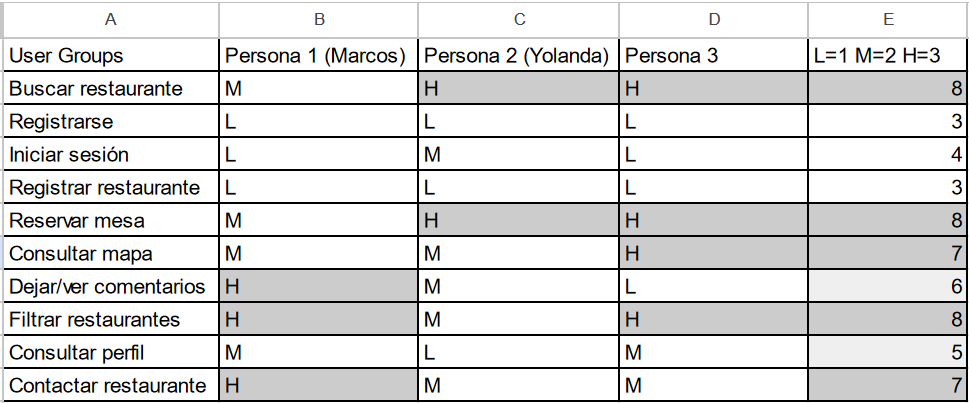

## Paso 2. UX Design  

 2.a Feedback Capture Grid
----

>>> El Feedback Capture Grid es una herramienta útil para recopilar y organizar las opiniones de los usuarios de manera estructurada. Ayuda a identificar áreas de éxito, oportunidades de mejora y a comprender las necesidades y expectativas del usuario, permitiendo así optimizar la experiencia y fortalecer la propuesta de valor de nuestra aplicación. Estos son los principales aspectos que mas han llamado la atención de los usuarios.

| Categoría    | Usuario         | Comentario                                                                                         |
|--------------|-----------------|----------------------------------------------------------------------------------------------------|
| Likes        | Yolanda         | Me encanta la función de reservar directamente desde la página. ¡Muy conveniente!                   |
| Likes        | Marcos        | La selección de restaurantes es excelente y me ha ayudado a descubrir nuevos lugares en mi ciudad.  |
| Questions    | Yolanda          | ¿Puedo cancelar mi reserva si cambian mis planes?                                                 |
| Questions    | Marcos           | ¿Cómo funciona el sistema de puntos para obtener descuentos?                                      |
| Ideas        | Yolanda          | Sería genial que pudieran agregar filtros para buscar restaurantes veganos o vegetarianos.         |
| Ideas        | Marcos           | Sugiero añadir una sección donde los usuarios puedan compartir sus experiencias culinarias.        |
| Criticisms   | Yolanda         | A veces la página tarda mucho en cargar y se vuelve un poco frustrante.                            |
| Criticisms   | Marcos          | He notado que algunos restaurantes tienen ofertas exclusivas en su sitio web y no en la aplicacion.      |

 2.b ScopeCanvas
----
>>> Nuestra propuesta consiste en crear una página web donde la gente tanto que es de Granada como los turistas puedan buscar restaurantes donde poder comer. Pero no solo se va a poder ver información del restaurante, también buscamos que haya una fácil comunicación con el local para resolver dudas, reservar una mesa a una hora concreta si hay disponibilidad y ofrecer descuentos por el uso de nuestros servicios. 

 2.b Tasks analysis 
-----

>>> Hemos decidido hacer la matriz de tareas/usuarios ya que tenemos un número elevado de tareas básicas que queremos realizar y nos podría ser más útil identificar cuales son las tareas que tienen prioridad o en las que debemos poner más esfuerzo para que sean cómodas, accesibles y fáciles de entender. 
>>> 
>>> Para hacer la matriz, primero buscamos las tareas principales que vamos a realizar en nuestra página. Una vez que tuvimos todas listadas, fijamos las personas como las dos que creamos en la práctica anterior (Yolanda y Marcos) y añadimos una tercera persona imaginaria basada en nuestra experiencia para obtener más datos. De esta forma, podemos saber que lo que más debemos trabajar es en el sistema de búsqueda, con un buen filtro que contemple todas las posibles opciones y en hacer un sistema de reserva intuitivo. Además, también tenemos que trabajar en añadir un mapa claro de donde se encuentra cada restaurante para facilitar a los turistas localizarlo y hacer que la comunicación entre el restaurante y el cliente sea lo más cómoda posible para ambas partes. 

 2.c IA: Sitemap + Labelling 
----

>>> Los términos seleccionados para etiquetar nuestra aplicación reflejan de manera concisa sus funciones y secciones principales, facilitando la navegación y el acceso rápido a áreas de interés. Estas etiquetas abarcan búsqueda de restaurantes, promociones, contenido relevante y soporte, ofreciendo una experiencia de usuario clara y coherente.

| Label                     | Scope Note                                                                                          |
|---------------------------|----------------------------------------------------------------------------------------------------|
| Login/Sing in             | Permite a los usuarios acceder/registrase en la plataforma con su cuenta de la página o con su cuenta de Google o IOS. |
| Search/Browse             | Permite a los usuarios buscar y explorar restaurantes por ciudad, nombre o tipo de cocina y el resto de la pagina web asi como sus blogs         |
| Nuevas Ofertas            | Muestra las promociones y descuentos disponibles en restaurantes seleccionados.                    |
| Reservar                  | Permite a los usuarios reservar una mesa en un restaurante.                                        |
| Más reservados            | Presenta una selección de los restaurantes más reservados.                                         |
| Registra Restaurante      | Permite a los restaurantes registrarse en la plataforma para que los usuarios puedan reservar.     |
| Mejor valorado            | Presenta una selección de los restaurantes mejor valorados y más reservados.                       |
| Blog                      | Contiene artículos y noticias relacionadas con restaurantes, gastronomía y tendencias culinarias.  |
| About Us                  | Incluye información sobre la historia de la empresa, el equipo, términos de uso y política de privacidad. |
| Help                      | Ofrece recursos de ayuda como preguntas frecuentes y opciones de contacto para los usuarios.       |
| Social Media              | Enlaces a las redes sociales de la aplicacion para que los usuarios puedan seguir y conectarse.          |

 2.d Wireframes
-----

>>> Este mockup es muy similar al de otras paginas que ya existen, como por ejemplo ElTenedor, pero con un diseño mas moderno y atractivo. La pagina principal esta dividida en 3 secciones principales: la seccion de busqueda, la seccion de recomendados y la seccion de promociones. La seccion de navegacion contiene el logo de la aplicacion, el boton de login, el boton de registro, el boton de busqueda y el boton de registrar restaurante ademas contiene un buscador, un menu desplegable para filtrar por ciudad y un menu desplegable para filtrar por tipo de cocina. La seccion de recomendados contiene una lista de restaurantes cercanos al cliente con buena valoración. En la seccion de promociones se encuentan las 3 principales categorias de busqueda en las cuales se redije con el buscador a una busqueda con parametros ya ajustados. En la parte inferior de la pagina se encuentran los enlaces a las redes sociales de la aplicacion asi como los enlaces de ayuda.

## Valoración de esta etapa

>>> En esta etapa hemos aprendido a utilizar las herramientas de UX para crear una pagina web que sea intuitiva y facil de usar para los usuarios. Hemos aprendido a crear un scope canvas, a crear un sitemap y a crear un labelling. Tambien hemos aprendido a crear un wireframe y a utilizar la herramienta de Figma para crearlo.
