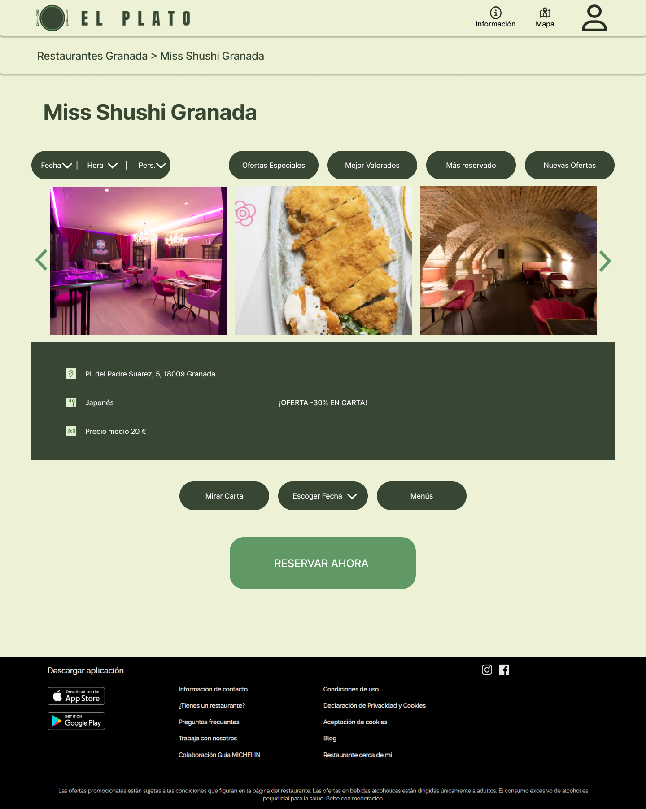

# DIU - Practica 3, entregables

## Moodboard (diseño visual + logotipo)   

>>> El logotipo está hecho con Canva y buscamos representar con el claramente el nombre de la web: El plato. El logo está hecho con la paleta de colores elegidos, habiendo comprobado un buen contraste entre los dos colores principales. Además, también hemos usado la fuente principal para títulos de la web en el logo. Las otras dos fuentes escogidas se usarán para los subtítulos como los nombres de los restaurantes y como fuente principal para el texto. Las fuentes tienen un tamaño asignado que hemos comprobado que sea adecuado para su uso. Como iconos hemos optado por algo simple y facilmente entendible. Las imagenes que usaremos serán de restaurantes y de comidas principalmente. 

## Landing Page

>>> En primer lugar tenemos la barra de arriba que es donde estará el logo de la web y también los iconos que nos lleven a las diferentes funcionalidades implementadas. En la cabecera principal hemos situado nuestro slogan con la font de título y debajo de él estaría el buscador por nombre y/o ciudad. A un lado habría una imagen que reprensente bien la comida granadina, con la distribución de plato, cuchillo y tenedor que haga recordar a nuestro logo. 
>>> En el cuerpo principal de la página, encontraremos una rueda de restaurantes seleccionados para la persona que está entrando en la web con la intención de llamar su atención de acuerdo a sus anteriores búsquedas para encontrar nuevos restaurantes o mostrar sus favoritos directamente. Debajo de esto estaría la sección de destacados, donde se mostrarían el restaurante más reservado, el mejor valorado y el que presente una nueva oferta. Esta parte se podría ir cambiando cada x días para que esté actualizado lo mejor posible. 
>>> Por último, estaría el pie de página con toda la información de contacto pertinente, las redes sociales y enlaces para descargar la aplicación. 

## Mockup: LAYOUT HI-FI

Enlace al prototipo: https://www.figma.com/proto/tQpGePuZSBLt27I7yvmmvi/LAYOUT-HI-FI?type=design&node-id=1-2&scaling=min-zoom&page-id=0%3A1&starting-point-node-id=1%3A2

## Documentación: Publicación del Case Study

(incluye) Valoración del equipo sobre la realización de esta práctica o los problemas surgidos
 
