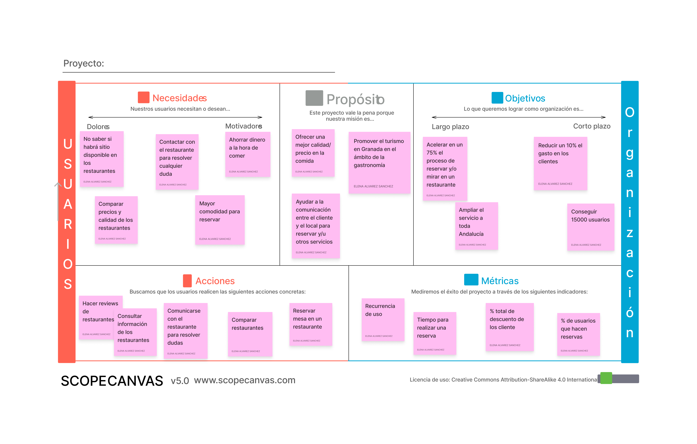

# DIU23
Prácticas Diseño Interfaces de Usuario 2022-23 (Tema: .... ) 

Grupo: Élite  Curso: 2022/23 
Updated: 19/5/2023

Proyecto: 
El plato

Descripción: 

>>> El plato es una web que permitará visualizar información sobre los restaurantes granadinos, permitiendo realizar reservas, consultar dudas con los restaurantes y valorar la experiencia del usuario. Además, por usar nuestra app ofreceremos vales de descuento. 

Logotipo: 

Miembros
 * :bust_in_silhouette:   Elena Álvarez Sánchez    :octocat:     
 * :bust_in_silhouette:  Carlos Moreno Villarrubia     :octocat:

----- 

# Proceso de Diseño 

## Paso 1. UX Desk Research & Analisis 

 1.a Competitive Analysis
-----

>>> Describe brevemente características de las aplicaciones que tienes asignadas, y por qué has elegido una de ellas (150-300 caracteres) 
>>> !!PENDIENTE!!

 1.b Persona
-----

>>> Yolanda ha sido escogida por representar a una persona de clase media, perteneciente a Granada y con una familia amplia. Por otro lado, Marcos representa a un turista joven y con discapacidad que es algo torpe con la tecnología. 

 1.c User Journey Map
----

>>> Comenta brevemente porqué has escogido estas dos experiencias de usuario (y si consideras que son habituales) (80-150 caracteres) 
>>> La experiencia de Yolanda se basa en la imposibilidad de poder reservar un tour para más de dos menores, algo habitual en familias con varios niños pequeños. La de Marcos es una situación más amena, con solo una pequeña dificultad para encontrar el botón de reserva, algo que puede ocurrir con asiduidad. 

 1.d Usability Review
----
>>>  Revisión de usabilidad: (toma los siguientes documentos de referncia y verifica puntos de verificación de  usabilidad
>>>> SE deben incluir claramente los siguientes elementos
>>> - Enlace al documento:  P1/Usability-review.xlsx
>>> - Valoración final (numérica): 68
>>> - Comentario sobre la valoración:  Aunque es una valoración decente, aún queda mucho margen de mejora con respecto al diseño y funcionalidad. Un claro ejemplo es el error de solapamiento de elementos en la interfaz de usuario. 

## Paso 2. UX Design  

 2.a Feedback Capture Grid / EMpathy map / POV
----

>>> Comenta con un diagrama los aspectos más destacados a modo de conclusion de la práctica anterior,

| Categoría    | Usuario         | Comentario                                                                                         |
|--------------|-----------------|----------------------------------------------------------------------------------------------------|
| Likes        | Yolanda         | Me encanta la función de reservar directamente desde la página. ¡Muy conveniente!                   |
| Likes        | Marcos        | La selección de restaurantes es excelente y me ha ayudado a descubrir nuevos lugares en mi ciudad.  |
| Questions    | Yolanda          | ¿Puedo cancelar mi reserva si cambian mis planes?                                                 |
| Questions    | Marcos           | ¿Cómo funciona el sistema de puntos para obtener descuentos?                                      |
| Ideas        | Yolanda          | Sería genial que pudieran agregar filtros para buscar restaurantes veganos o vegetarianos.         |
| Ideas        | Marcos           | Sugiero añadir una sección donde los usuarios puedan compartir sus experiencias culinarias.        |
| Criticisms   | Yolanda         | A veces la página tarda mucho en cargar y se vuelve un poco frustrante.                            |
| Criticisms   | Marcos          | He notado que algunos restaurantes tienen ofertas exclusivas en su sitio web y no en la aplicacion.      |
  
    
>>> Nuestra propuesta se basa en ofrecer un buen catálogo de restaurantes con los que poder hacer reservas de forma rápida y fácil, obtener descuentos y contactar con dichos restaurantes en caso de tener dudas o algún tipo de problema que comentar. 

 2.b ScopeCanvas
----
>>>  En esta imagen, están todas nuestras propuestas y planes con respecto al proyecto con mayor detalle, pensando en una ampliación de servicio para toda Andalucía y tener una base sólida de usuarios por ejemplo. 

 2.b Tasks analysis 
-----

>>> En esta imagen podemos ver las principales tareas que se realizan en nuestra web, siendo las más importantes la búsqueda, filtración y reserva del restaurante. Además, no podemos olvidarnos de trabajar en un mapa claro y limpio para el usuario y en la comunicación fácil y rápida entre el restaurante y el usuario. 

 2.c IA: Sitemap + Labelling 
----

| Término                   | Significado                                                                                        |
|---------------------------|----------------------------------------------------------------------------------------------------|
| Login/Sing in             | Permite a los usuarios acceder/registrase en la plataforma con su cuenta de la página o con su cuenta de Google o IOS. |
| Search/Browse             | Permite a los usuarios buscar y explorar restaurantes por ciudad, nombre o tipo de cocina y el resto de la pagina web asi como sus blogs         |
| Nuevas Ofertas            | Muestra las promociones y descuentos disponibles en restaurantes seleccionados.                    |
| Reservar                  | Permite a los usuarios reservar una mesa en un restaurante.                                        |
| Más reservados            | Presenta una selección de los restaurantes más reservados.                                         |
| Registra Restaurante      | Permite a los restaurantes registrarse en la plataforma para que los usuarios puedan reservar.     |
| Mejor valorado            | Presenta una selección de los restaurantes mejor valorados y más reservados.                       |
| Blog                      | Contiene artículos y noticias relacionadas con restaurantes, gastronomía y tendencias culinarias.  |
| About Us                  | Incluye información sobre la historia de la empresa, el equipo, términos de uso y política de privacidad. |
| Help                      | Ofrece recursos de ayuda como preguntas frecuentes y opciones de contacto para los usuarios.       |
| Social Media              | Enlaces a las redes sociales de la aplicacion para que los usuarios puedan seguir y conectarse.          |

 2.d Wireframes
-----

>>> Este mockup es muy similar al de otras paginas que ya existen, como por ejemplo ElTenedor. La pagina principal esta dividida en 3 secciones principales: la sección de búsqueda, la sección de recomendados y la sección de promociones. La sección de navegación contiene el logo de la aplicación, el botón de login, el botón de registro, el botón de busqueda y el botón de registrar restaurante. Además contiene un buscador, un menú desplegable para filtrar por ciudad y un menú desplegable para filtrar por tipo de cocina. La sección de recomendados contiene una lista de restaurantes cercanos al cliente con buena valoración. En la seccion de promociones se encuentan las 3 principales categorias de busqueda en las cuales se redije con el buscador a una búsqueda con parametros ya ajustados. En la parte inferior de la pagina se encuentran los enlaces a las redes sociales de la aplicación así como los enlaces de ayuda.

## Paso 3. Mi UX-Case Study (diseño)

 3.a Moodboard
-----

>>>Nuestro logotipo está hecho con canva, una aplicación de edición y diseño de imágenes que incluye patrones y tamaños determinados para numerosos casos. En esta web, los logotipos están definidos como imagenes cuadradas de 500x500 px, una resolución adecuada ya que va a estar en una esquina y no va a ser muy grande. Si en las redes sociales hiciese falta, se puede rehacer a una resolución de 1000x1000 como icono de perfil o incluso se puede utilizar otros patrones de la app para hacer posts. 

  3.b Landing Page
----

>>> En primer lugar tenemos la barra de arriba que es donde estará el logo de la web y también los iconos que nos lleven a las diferentes funcionalidades implementadas. En la cabecera principal hemos situado nuestro slogan con la font de título y debajo de él estaría el buscador por nombre y/o ciudad. A un lado habría una imagen que reprensente bien la comida granadina, con la distribución de plato, cuchillo y tenedor que haga recordar a nuestro logo. En el cuerpo principal de la página, encontraremos una rueda de restaurantes seleccionados para la persona que está entrando en la web con la intención de llamar su atención de acuerdo a sus anteriores búsquedas para encontrar nuevos restaurantes o mostrar sus favoritos directamente. Debajo de esto estaría la sección de destacados, donde se mostrarían el restaurante más reservado, el mejor valorado y el que presente una nueva oferta. Esta parte se podría ir cambiando cada x días para que esté actualizado lo mejor posible. Por último, estaría el pie de página con toda la información de contacto pertinente, las redes sociales y enlaces para descargar la aplicación.

 3.c Guidelines
----

>>> Nuestra página tiene 6 colores, el blanco, el negro y 4 tonalidades de verde. Los colores principales son el verde más clarito y el más oscuro para generar un buen contraste. Para la tipografía hemos escogido 3 diferentes, aunque todas ellas pensadas para que sean claras y para que combinen bien juntas. Los iconos también son claros y minimalistas. 
>>> Buscamos que nuestro diseño sea adaptable y se vea bien en móvil ya que creemos que es donde más se van a realizar las búsquedas y reservas. También tenemos como objetivo que todos los elementos estén claramente diferenciados y tengan el mismo espacio e información que sus símiles para crear una coherencia visual. Para lograr también una consistencia, hemos buscado el balance y la simetría en su conjunto global. Con el fin de llamar la atención del usuario a algunas partes de la web, hemos cambiado el uso de los colores, siempre buscando que el contrate sea el mayor posible. 
>>> Los patrones de diseño que hemos utilizado son: la barra de navegación flotante, menús despegables para las reservas, un carrusel de restaurantes destacados y un mapa de la zona con los restaurantes marcados. 

  3.d Mockup
----

>>> Aquí está el enlace sonde se puede hacer una prueba interactiva de cómo sería el funcionamiento de nuestra página: https://www.figma.com/proto/tQpGePuZSBLt27I7yvmmvi/LAYOUT-HI-FI?type=design&node-id=1-2&scaling=min-zoom&page-id=0%3A1&starting-point-node-id=1%3A2
>>> Y aqui un video de demostracion https://github.com/Elenalvarez/DIU/assets/92320280/7cdd7700-1bce-48e4-a361-92377a253741

 3.e ¿My UX-Case Study?
-----

## Paso 4. Evaluación 

 4.a Caso asignado
----

>>> Breve descripción del caso asignado con enlace a  su repositorio Github

 4.b User Testing
----

>>> Seleccione 4 personas ficticias. Exprese las ideas de posibles situaciones conflictivas de esa persona en las propuestas evaluadas. Asigne dos a Caso A y 2 al caso B
 

| Usuarios | Sexo/Edad     | Ocupación   |  Exp.TIC    | Personalidad | Plataforma | TestA/B
| ------------- | -------- | ----------- | ----------- | -----------  | ---------- | ----
| User1's name  | H / 18   | Estudiante  | Media       | Introvertido | Web.       | A 
| User2's name  | H / 18   | Estudiante  | Media       | Timido       | Web        | A 
| User3's name  | M / 35   | Abogado     | Baja        | Emocional    | móvil      | B 
| User4's name  | H / 18   | Estudiante  | Media       | Racional     | Web        | B 

. 4.c Cuestionario SUS
----

>>> Usaremos el **Cuestionario SUS** para valorar la satisfacción de cada usuario con el diseño (A/B) realizado. Para ello usamos la [hoja de cálculo](https://github.com/mgea/DIU19/blob/master/Cuestionario%20SUS%20DIU.xlsx) para calcular resultados sigiendo las pautas para usar la escala SUS e interpretar los resultados
http://usabilitygeek.com/how-to-use-the-system-usability-scale-sus-to-evaluate-the-usability-of-your-website/)
Para más información, consultar aquí sobre la [metodología SUS](https://cui.unige.ch/isi/icle-wiki/_media/ipm:test-suschapt.pdf)

>>> Adjuntar captura de imagen con los resultados + Valoración personal 

 4.d Usability Report
----

>> Añadir report de usabilidad para práctica B (la de los compañeros)

>>> Valoración personal 

>>> ## Paso 5. Evaluación de Accesibilidad  (no necesaria)

>>>   5.a Accesibility evaluation Report 
>>>> ----

>>> Indica qué pretendes evaluar (de accesibilidad) sobre qué APP y qué resultados has obtenido 

>>> 5.a) Evaluación de la Accesibilidad (con simuladores o verificación de WACG) 
>>> 5.b) Uso de simuladores de accesibilidad 

>>> (uso de tabla de datos, indicar herramientas usadas) 

>>> 5.c Breve resumen del estudio de accesibilidad (de práctica 1) y puntos fuertes y de mejora de los criterios de accesibilidad de tu diseño propuesto en Práctica 4.

## Conclusión final / Valoración de las prácticas

>>> (90-150 palabras) Opinión del proceso de desarrollo de diseño siguiendo metodología UX y valoración (positiva /negativa) de los resultados obtenidos  

